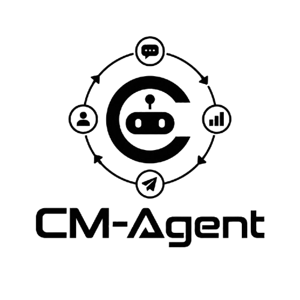

# CM Agent

<p align="center">
  
</p>

CM Agent est une plateforme d’intelligence artificielle pensée pour aider les équipes à transformer leur présence sur les réseaux sociaux en un levier de croissance durable. L’objectif est simple : automatiser les tâches répétitives, améliorer l’engagement et accélérer la prospection sans sacrifier la qualité humaine.

## Pourquoi CM Agent ?

CM Agent permet de :

- gagner du temps sur la production et la gestion quotidienne des réseaux sociaux,
- maintenir une présence active et cohérente sur plusieurs canaux,
- améliorer l’engagement grâce à des interactions plus intelligentes,
- générer plus de leads et de opportunités commerciales avec moins d’effort manuel,
- offrir une expérience produit moderne, fluide et orientée résultat.

## Ce que propose la plateforme

### Publication automatique


Planifiez, programmez et publiez du contenu de manière régulière pour garder une présence forte, même quand l’équipe est occupée ailleurs.

### Engagement intelligent


Stimulez les interactions avec votre audience grâce à des actions ciblées et à une logique d’engagement plus pertinente.

### Prospection automatisée


Identifiez et qualifier les opportunités plus rapidement pour construire un pipeline plus solide et plus réactif.

### Relances et outreach


Automatisez les relances et les suivis pour renforcer la conversion sans multiplier les efforts manuels.

## Les avantages clés

- Productivité accrue : moins de tâches répétitives, plus de temps dédié au stratégique.
- Cohérence de marque : un ton, un rythme et une qualité de contenu homogènes.
- Meilleure conversion : plus d’interactions pertinentes, plus d’opportunités qualifiées.
- Expérience premium : une interface moderne, visuelle et orientée conversion.
- Scalabilité : adapté aux équipes qui veulent grandir sans perdre en efficacité.

## Une expérience pensée pour convertir

Le site de présentation est conçu comme une landing page immersive qui accompagne l’utilisateur dans un parcours clair : découvrir la promesse du produit, comprendre les bénéfices, puis rejoindre la liste d’attente via un formulaire simple et efficace.

## Fonctionnement du parcours d’inscription

1. L’utilisateur découvre la valeur de CM Agent.
2. Il découvre les principales fonctionnalitées via des visuels et des messages orientés bénéfices.
3. Il peut rejoindre la liste d’attente via un formulaire simple.
4. Les informations sont envoyées à une API interne et traitées pour l’enregistrement.
5. L’utilisateur arrive sur une page de confirmation rassurante.

## Stack technique

- Nuxt 4
- Vue 3
- TypeScript
- Tailwind CSS
- Nuxt Icon
- Nuxt Color Mode
- Nuxt Google Fonts
- API route server-side pour l’inscription

## Structure du projet

```text
app/
  components/      Composants UI et sections de la landing page
  pages/           Pages principales du site
  assets/          Styles globaux et ressources
server/
  api/             API serveur pour la liste d’attente
```

## Installation locale

### Prérequis

- Node.js 20+
- npm, pnpm, yarn ou bun

### Installer les dépendances

```bash
npm install
```

### Démarrer le site

```bash
npm run dev
```

Le site sera alors disponible sur http://localhost:3000.

## Variables d’environnement

Le dépôt attend une configuration runtime pour l’API de stockage :

```env
NUXT_BASEROW_API_TOKEN=your_token_here
```

Cette valeur est utilisée par l’API du endpoint de liste d’attente dans [server/api/waitlist.post.ts](server/api/waitlist.post.ts).

## Contact

Pour toute question liée au produit, au site ou à l’intégration, vous pouvez contacter l’équipe derrière Tech2Work.
